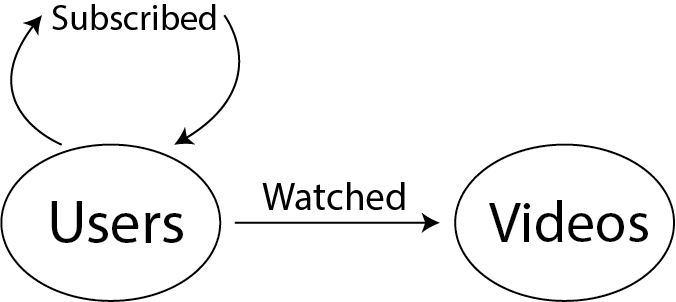

# FREQL : Fast Recommendation Engine Query Language

## What is FREQL?

FREQL is a realtime, highly scalable recommendation engine with a SQL-like query language.  It can be used both as a huge in-memory distributed graph database and as a "multimodal", "collaborative filtering" rec engine.

## Contents

[Why FREQL?](#why-freql-over-a-spark-based-library)

[Writing your Recommender App](#writing-your-app)

[Query API](doc/queries.md)

[Requirements](doc/requirements.md)

[Building and Running](doc/build_and_run.md)

## Why FREQL over a Spark based Library?

This library is inspired by a state-of-the-art Apache Spark [Mahout library](https://mahout.apache.org/docs/latest/algorithms/reccomenders/) but improves on it in a number of ways:

1. Any Spark-based solution suffers from immutability; an inability to modify a matrix without creating a whole new copy of it. This is not good when your matrix is billions of rows.  Spark was tossed out early on and replaced with Apache Ignite, a distributed computing engine that allows for changing only the data that is relevant to an incoming update.
2. Mahout and similar libraries generate recommendations by matrix multiplication.  This means O(n^3) operations even for a single update.  FREQL replaces the traditional multiplication approach with a much faster O( n * log(n) ) algorithm, leading to realtime recommendations in practice.
3. FREQL uses a sparse distributed hashtable instead of a dense matrix representation, typically resulting in a ~90% reduction in cluster size since the matricies mostly contain zeros.
4. Extremely multimodal, mix many dimensions of a user's data to get better and better results.
5. A flexible, type-safe query lanuage that mixes graph queries with recommendation scores!

## Writing your App

Interacting with FREQL simply requires implementing the "FreqlApp" interface in Scala or Java.
The examples folder has a reference "FakeYouToobApp" that will be used for demonstration here
and is a great starting point to see how a custom "FreqlApp" works.
You simply define the input EventStreams, with each event being a node->edge->node occurrence, OutputStreams
to save to (typically over HTTP to some persistent API), and the queries you'd like answered between them.
Writing your FreqlApp in Scala allows you to write in a type-safe DSL that's similar to SQL.

### Step 1: Define your Node types and Relations

Think about your data in graph terms.  For FakeYouToob, we might have User nodes with outgoing edges to watched Videos or my Subscribers:

#####

#####

    object User extends Node()

    object Video extends Node()

    object Watched extends Edge()

    object Subscribed extends Edge()

    val WatchedVideo = Relation(User, Watched, Video)

    val SubscribedToUser = Relation(User, Subscribed, User)

### Step 2: Defining your Queries
Now we could do a boring graph query to get all of User 1's watched videos using **Select & FromItems**:

    Select(Video,

    FromItems(WatchedVideo))

Or something more interesting like finding users similar to me based on what I've watched *and* who I subscribe to using **SUGGEST & FROM** (multimodal FTW):

    val similarUsers =

    Suggest(User,

    From(WatchedVideo) Join SubscribedToUser

    Where Not InputEqualsOutput ) //(Exclude myself)

This query will ultimately be passed a User Id to get other users most similar to him/her.  Now we can traverse similarUsers "To" their watched videos as Autoplay recommendations:

    val autoplaySuggestions =

    Suggest(Video,

    From(similarUsers) To WatchedVideos

    Where Not InputRelatedBy( WatchedVideo )  //Filter out what I've already seen

Functional composition FTW!  Now you can call

    autoplaySuggestions( Id("1") )

to suggest videos for User 1.

[See Query API for more details](doc/queries.md)

### Step 3: Define your input EventStreams and OutputStreams

Kafka makes for a great replay-able and scalable stream of input events,
so a KafkaEventStream is provided by default though you can easily create your own EventStream.
An "Event" is simply an occurrence of some node Id with an edge pointing to some other node Id.
You can choose to trigger output either by explicit request, or by a reaction to
recommendations changing in realtime.  For either purpose you'll want to use a
TriggeredQuery or ReactiveQuery respectively, both of which have simple HTTP implementations.
